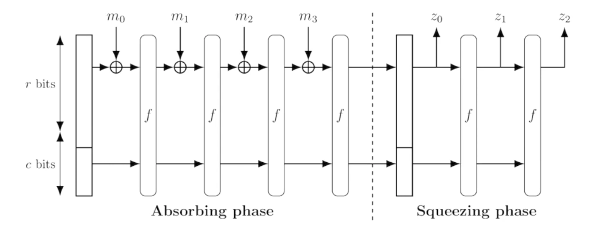

# MiMC hashing implemented in circom

MiMC5Sponge is a block cipher and hash function family designed specifically for SNARK applications.



### NOTE: We are implementing x^5 instead of x^3

Pre-Requisite

1. Circom2.0 should be installed.
2. snarkjs should be installed.

Navigate to the root of the project directory in your terminal and do

```bash
npm install
```

Run these commands in order

1. To compile the circuit

```bash
circom circuit.circom --r1cs --wasm
```

2. To run the circuit

```bash
node ./circuit_js/generate_witness.js ./circuit_js/circuit.wasm input.json witness.wtns
```

3. To run the utility

```bash
snarkjs wtns export json witness.wtns witness.json
```

4. Compile and deploy the smart contract Hasher(on remix or your local machine).

5. Compare the hash value received in contract to the output.json file (first 4 values)
